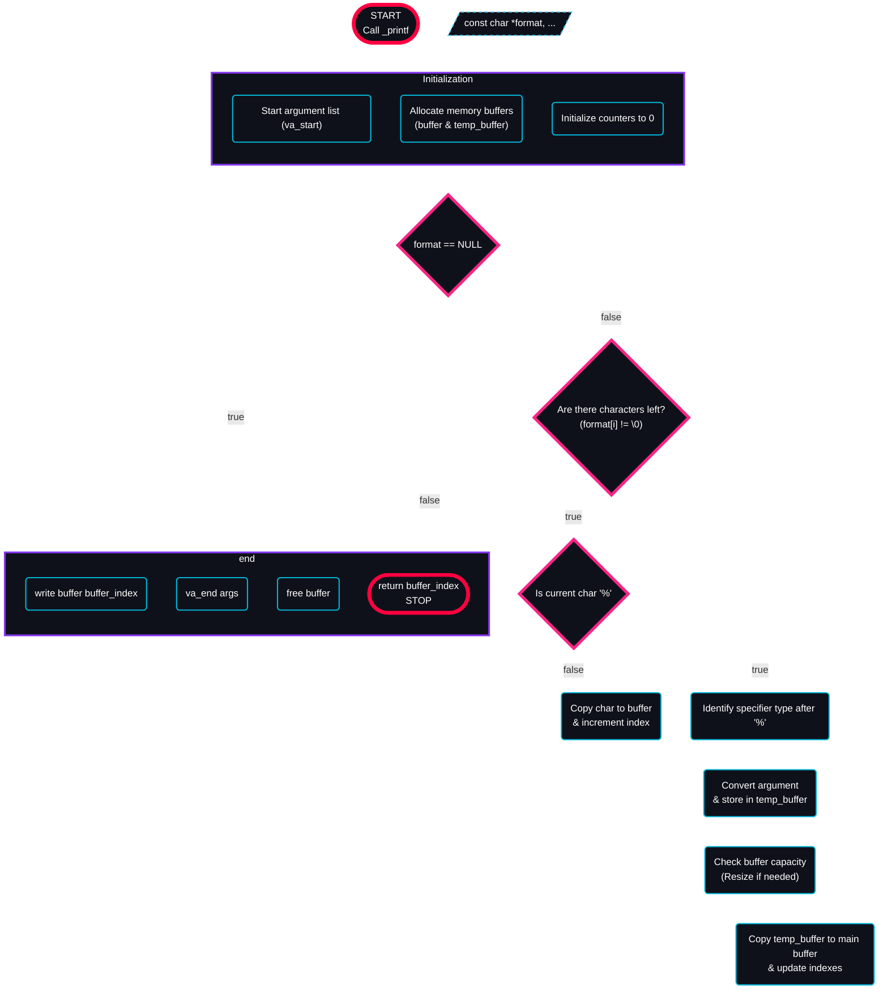

# Holbertonschool-printf

## Overview

**holbertonschool-printf** is a project developed to deepen the understanding of key concepts in the **C** programming language.

the core function is [**_printf.c**](printf.c), which is a custom implementation of **printf**,

All of the project's source code was developed and compiled using the strict **gcc** arguments:  
`-Wall -Werror -Wextra -pedantic -std=gnu89`  
This ensures **high code quality** and **maximum portability**.

## Usage

**`int _printf(const char *format, ...);`**

where **format** is the base string to be printed,
for adding variable integration you have to use **%** followed by a character

| character | variable type | printed to |
|:--:|:--:|:--:|
| **s** | string | [string](print_string.c) |
| **c** | char | [char](print_char.c) |
| **i, d** | integer | [integer](print_integer.c) |
| **u** | unsigned integer | [unsigned integer](print_unsigned_integer.c) |
| **b** | integer | [binary](print_binary.c) |
| **o** | integer | [octal](print_octal.c) |
| **x** | integer | [hexadecimal](print_hexadecimal_lower.c) |
| **X** | integer | [hexadecimal](print_hexadecimal_upper.c) |
| **p** | any | [the adress in hexadecimal](print_adresse.c) |
| **%** | none | [%](print_percent.c) |

## How it work

the **_printf** function is mainly based on the **variadic function** to get the variable, and on the **function pointer** with a dedicated function [**get_type();**](get_type.c) to print the variables in the good format




## Exemple

```c
_printf("%s", string_var);
_printf("%u", unsigned_integer_var);
_printf("%p", any_var);
```

## How to use

### clone the repo

```bash
git clone https://github.com/ylabate/holbertonschool-printf.git
cd holbertonschool-printf
```

### make your main file

```bash
echo '#include "main.h"\n\nint main(void)\n{\n\t/* your code go here */\n\t_printf("test\\n");\nreturn (0);\n}' > main.c
```

### Compile and Run

To successfully compile your program, you must include all your source files (`*.c`) including your main.c in the **`gcc`** command:

```bash
gcc -Wall -Werror -Wextra -pedantic -std=gnu89 *.c
./a.out
```

## Contributor

this project was developped by only myself in **5** days for the **Holberton School** of **rodez**

* [**ylabate**](https://github.com/ylabate)
