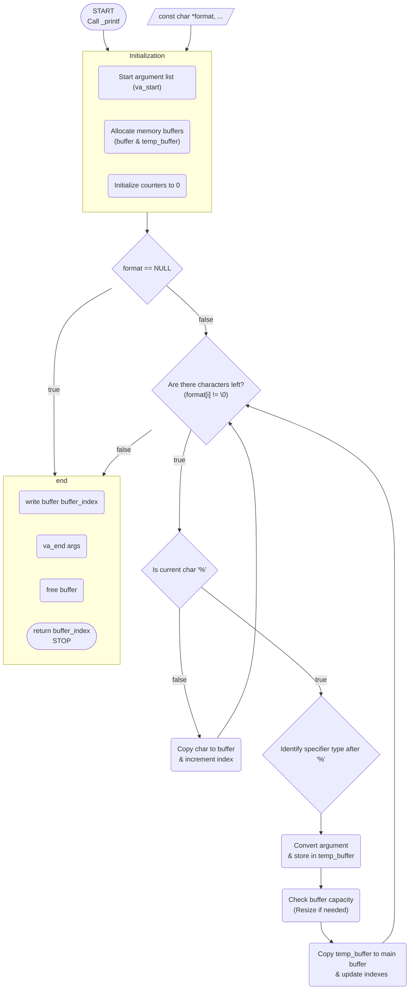

```mermaid
flowchart TB
 subgraph B["Initialization"]
        1("Start argument list (va_start)")
        2("Allocate memory buffers
        (buffer & temp_buffer)")
        4("Initialize counters to 0")
  end
 subgraph END["end"]
        6("write buffer buffer_index")
        7("va_end args")
        8("free buffer")
        9(["return buffer_index
        STOP"])
  end
    A(["START
    Call _printf"]) --> B
    Abis[/"const char *format, ..."/] --> B
    B --> Bbis{"format == NULL"}
    Bbis -- false --> C{"Are there characters left?
    (format[i] != \0)"}
    Bbis -- true --> END
    C -- false --> END
    C -- true --> D{Is current char '%'}
    D -- false --> E("Copy char to buffer
    & increment index")
    D -- true --> F{Identify specifier type after '%'}
    E --> C
    F --> H("Convert argument
    & store in temp_buffer")
    H --> I("Check buffer capacity
    (Resize if needed)")
    I --> K("Copy temp_buffer to main buffer
    & update indexes")
    K --> C
```

